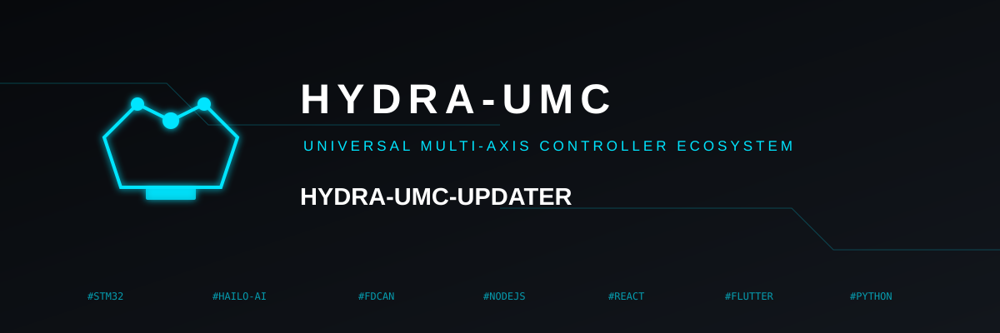
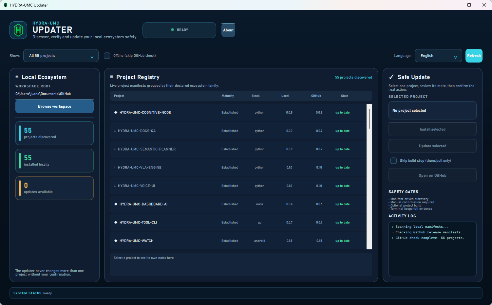
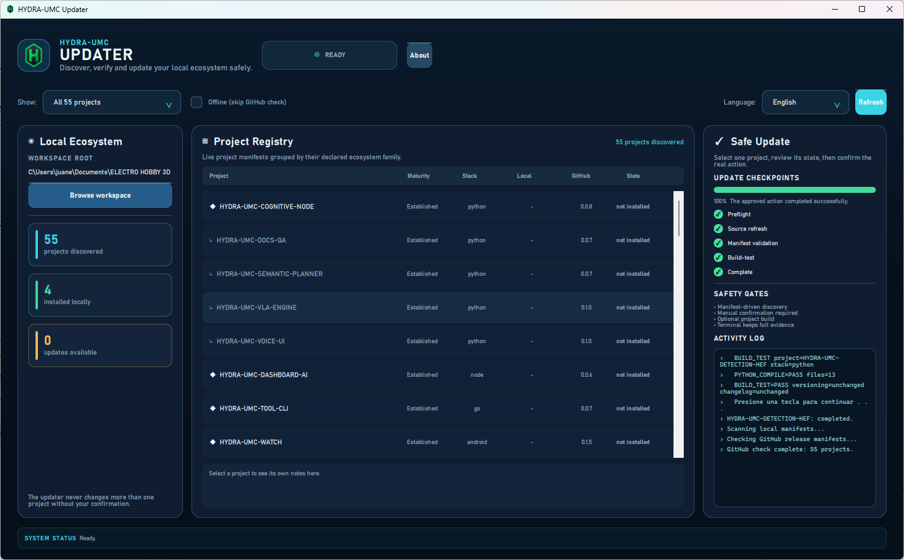

<p align="center">
  
</p>

<p align="center">
  
</p>

<p align="center">
  
</p>

# 🛠️ HYDRA-UMC-UPDATER

<p align="center"><a href="README.md">🇺🇸 English</a> | <a href="README_spa.md">🇪🇸 Español</a> | 🇫🇷 <b>Français</b> | <a href="README_ita.md">🇮🇹 Italiano</a> | <a href="README_deu.md">🇩🇪 Deutsch</a> | <a href="README_zho.md">🇨🇳 简体中文</a> | <a href="README_jpn.md">🇯🇵 日本語</a></p>

### 📦 Détecte, installe et met à jour à la main tout l'écosystème HYDRA-UMC/URTC

<p align="left">
  
  
  
  
</p>

> **Mode bureau visuel :** l'interface bureau par defaut utilise maintenant
> **Qt Quick / QML** avec le runtime GUI optionnel `PySide6`. Le coeur et le
> mode `--cli` restent uniquement bases sur la bibliotheque standard pour une CM5 headless.
>
> **Demarrage Windows et preuves :** ouvrez `run-gui.vbs` (ou `run.bat` sans
> argument) pour le client graphique sans console. Le panneau de mise a jour
> affiche les etapes reelles de controle, source, manifeste, build-test et fin
> avec les preuves capturees ; `run.bat --cli ...` conserve le terminal de diagnostic.
> Installer n'est actif que sans checkout et Mettre a jour seulement si GitHub
> est plus recent. Pendant une action approuvee, les checkpoints remplacent les
> controles du projet ; choisir un autre projet les restaure.
> **Installer tous les manquants** et **Mettre a jour tous les depasses** sont
> des actions par lot sequentielles, confirmees separement et fondees sur le
> meme etat reel et parcours de securite.

---

## 1. 🛠️ VUE TECHNIQUE

HYDRA-UMC-UPDATER est un petit outil - GUI avec fenêtre par défaut, CLI
complète avec `--cli` - destiné à tourner aussi bien sur le vrai CM5 que
sur la propre machine Windows/Linux/macOS d'un développeur (n'importe
quel workspace avec le même type de checkout) qui répond à trois
questions pour chacun des 44 autres projets de l'écosystème :

1. **Qu'est-ce qui est réellement installé ici, et dans quelle version ?**
2. **Quelle est la dernière version publiée sur GitHub ?**
3. **Si GitHub est plus récent, laisse-moi mettre à jour CE projet, à la main.**

Ce dernier point est délibéré et non négociable : cet outil ne met
jamais à jour plus d'un projet par commande, et jamais de sa propre
initiative. Une cellule de contrôle de robots n'est pas quelque chose
qu'on veut voir se mettre à jour toute seule pendant la nuit - chaque
mise à jour réelle est une commande (ou un clic sur un bouton, pour une
ligne sélectionnée dans le tableau de la GUI) qu'une personne a
déclenchée, pour un projet nommé, dont elle peut voir le résultat avant
de toucher au suivant.

Les 44 projets n'appartiennent pas non plus tous au CM5 - la plupart des
dépôts préfixés URTC et quelques-uns de HYDRA-UMC sont des outils qu'un
développeur exécute depuis son propre PC (le firmware est compilé et
flashé DEPUIS un poste de travail, pas construit SUR la cellule), ou des
applications installées sur un téléphone/une montre. Le propre champ
`deploy` de `registry.py` enregistre lequel est lequel (voir section 3),
et le tableau de projets de la GUI filtre dessus - par défaut il
n'affiche que "CM5" quand il détecte tourner sous Linux (le propre OS du
vrai CM5), et "tout afficher" sous Windows/macOS.

```
$ hydra-umc-updater --cli status
Workspace root: /home/pi/HYDRA-UMC
Checking GitHub... 44/44
PROJECT                        STACK       LOCAL     GITHUB    STATE
--------------------------------------------------------------------
HYDRA-UMC                      firmware-c  0.0.7     0.0.7     up to date
HYDRA-UMC-SERVER               node        0.0.5     0.0.9     OUTDATED
HYDRA-UMC-STUDIO               node        0.0.8     0.1.3     OUTDATED
...
44/44 installed, 2 outdated

$ hydra-umc-updater --cli update HYDRA-UMC-SERVER
Updating HYDRA-UMC-SERVER into /home/pi/HYDRA-UMC ...
OK  Pulled latest into /home/pi/HYDRA-UMC/HYDRA-UMC-SERVER
OK  build.sh completed successfully.
```

Lancer `hydra-umc-updater` sans argument (ou double-cliquer dessus) ouvre
la même information dans une fenêtre - un tableau de projets, un filtre
par cible de déploiement, et des boutons Installer/Mettre à jour pour la
ligne sélectionnée.

## 2. 🔄 COMMENT FONCTIONNE VRAIMENT UNE VÉRIFICATION/MISE À JOUR

- **Source de la version** : la convention "compteur kilométrique"
  d'auto-incrémentation de cet écosystème (chaque build réel incrémente
  un numéro de version qui vit DANS un fichier source -
  `pyproject.toml`, `Cargo.toml`, `version.go`, `package.json`,
  `version.properties`, `pubspec.yaml`, ou un `#define` de firmware,
  selon la stack du projet) n'a jamais créé de tag git ni de GitHub
  Release pour cet incrément. Cet outil lit donc le MÊME fichier que le
  propre `bump_version.py`/script de build de chaque projet écrit déjà,
  directement depuis la branche par défaut du dépôt via l'hébergeur de
  contenu brut de GitHub - pas l'API des Releases, qui indiquerait que
  tous les projets n'ont aucune release.
- **Détection locale** : pour chacun des 44 projets connus, vérifie si
  un répertoire portant ce nom exact existe sous la racine du workspace
  (la disposition standard de l'écosystème - chaque projet en tant que
  répertoire voisin, exactement ce que supposent déjà build-frontend.sh
  et la propre découverte de HYDRA-UMC-SUITE), et si oui, lit sa propre
  copie locale de ce même fichier de version.
- **Une seule implémentation d'analyse** (`version_parse.py`) est
  partagée entre la lecture locale et la récupération GitHub, donc un
  checkout local et une récupération GitHub ne sont jamais interprétés
  par deux regex pouvant diverger indépendamment.
- **Installer/mettre à jour** : `git clone` (installation) ou `git pull
  --ff-only` (mise à jour - jamais un reset forcé, donc de vraies
  modifications locales échouent bruyamment plutôt que d'être écrasées),
  puis exécute le `build.sh`/`build.bat` propre à ce projet (ou un
  équivalent connu - voir section 3). Cet outil ne réimplémente jamais
  les étapes de build propres à un projet - voir section 3 pour le
  pourquoi.

## 3. 🧱 ARCHITECTURE ET DÉCISIONS DE CONCEPTION

- **GUI Qt Quick par defaut, `--cli` pour le headless.** `main.py` verifie
  `--cli` avant d'importer le runtime PySide6 optionnel. La CLI fonctionne
  sur une CM5 sans ecran ni dependance desktop ; sans argument QML demarre
  lorsqu'il est disponible et Tkinter reste seulement un fallback temporaire.
- **`deploy` est une classification, pas une restriction.** Traiter les
  44 projets comme "des choses qui appartiennent au CM5" était une
  erreur - les dépôts de firmware sont compilés et flashés DEPUIS un PC
  (le CM5 n'a besoin que du binaire résultant via CAN-OTA, jamais du code
  source de ce dépôt), et plusieurs outils (URTC-FLASHER,
  HYDRA-UMC-SUITE, HYDRA-UMC-TOOL-CLI, ...) sont destinés à tourner sur
  le propre poste de travail d'un opérateur, pas dans la cellule
  elle-même. Le champ `deploy` de `registry.py` ("cm5" / "user-pc" /
  "mobile" / "wearable") enregistre cela, et le filtre de la GUI l'utilise
  comme point de départ raisonnable - jamais comme une restriction dure,
  puisque cet outil est aussi destiné à tourner sur le propre PC d'un
  développeur, où les 44 sont tous aussi légitimes à inspecter.
- **Aucune logique de build par stack dans cet outil.** L'écosystème
  couvre 7 chaînes d'outils (Python, Rust, Go, Node/TS, Android/Kotlin,
  Flutter, firmware ARM). Réimplémenter `npm install && npm run build` /
  `cargo build --release` / `./gradlew assembleDebug` / etc. ICI créerait
  un second endroit prétendant savoir comment compiler chaque projet,
  garanti de diverger du `build.sh`/`.bat` réel (et déjà correct) de ce
  projet. `install.py` recherche plutôt un nom de script de build connu
  (`build.sh`, `build_firmware.sh`, `build_exe.sh`, `build-android.sh`,
  et leurs équivalents `.bat` - les noms réels utilisés à travers les 44
  projets) et exécute celui qui existe.
- **Contenu brut de GitHub, pas l'API des Releases.** Voir la section 2 -
  la convention de versionnage de cet écosystème ne crée jamais de
  tag/release, donc l'API des Releases serait activement fausse ici, pas
  seulement moins pratique.
- **Un échec réseau transitoire reçoit un vrai réessai ; une réponse
  définitive jamais.** Chaque requête GitHub réelle (`_urlopen_with_retries`
  de `github_client.py`) réessaie jusqu'à 3 fois avec un backoff, mais
  uniquement quand la connexion n'a jamais obtenu de réponse du tout
  (DNS/timeout/reset). Un statut HTTP réel que GitHub a effectivement
  renvoyé - 404, 403, 500 - n'est jamais réessayé : GitHub a déjà
  répondu, et insister ne ferait que consommer davantage de quota pour le
  même résultat.
- **Un catalogue distant malformé échoue bruyamment ; un seul projet
  malformé non.** Si le listing des dépôts GitHub lui-même est
  injoignable ou illisible, `discover_remote_projects()` lève une
  exception - `gui.py` et `main.py` la capturent déjà tous les deux et
  retombent sur la liste de projets découverts localement plutôt que
  d'afficher un scan cassé ou vide. Le manifeste malformé d'un seul dépôt,
  en revanche, est isolé dans la liste `errors` de ce scan et n'interrompt
  jamais la découverte du reste - un vrai test avec serveur de fixtures
  (`tests/test_github_client.py`) prouve les deux chemins.
- **`install`/`update` prennent toujours un nom de projet explicite.**
  Il n'existe pas de sous-commande "tout mettre à jour", et c'est une
  décision de conception, pas une fonctionnalité manquante - une flotte
  de robots réels n'est pas quelque chose qu'on laisse se mettre à jour
  sans surveillance. `status` montre ce qui est obsolète ; une personne
  choisit lequel toucher réellement.
- **Bibliothèque standard uniquement.** `urllib` pour les récupérations
  GitHub (`github_client.py`), `subprocess` pour les appels git/scripts
  de build (`install.py`), rien d'autre - qu'un outil responsable de
  maintenir saines les dépendances de TOUS les autres projets reste
  lui-même sans dépendances est délibéré.
- **Simplification connue** : HYDRA-UMC et URTC sont de vrais dépôts de
  firmware multi-composants (6 et 4 binaires versionnés indépendamment
  chacun - voir leur propre `VERSION_CHECKLIST.txt`/`build_firmware.sh`)
  sans numéro de version unique. `registry.py` suit UN composant
  représentatif par dépôt - suffisant pour répondre "ce dépôt est-il à
  peu près à jour ?", pas un remplacement du propre
  `firmware_manifest.json` de `build_firmware.sh` pour un vrai flashage.

## 📂 STRUCTURE DES RÉPERTOIRES

```
HYDRA-UMC-UPDATER/
├── src/hydra_umc_updater/
│   ├── registry.py        # Les 44 projets : dépôt, stack, fichier de version, motif, cible de déploiement
│   ├── version_parse.py   # UNE implémentation d'extraction regex, local+GitHub
│   ├── detect.py          # Scanne une racine de workspace pour ce qui est installé
│   ├── github_client.py   # Récupération concurrente du contenu brut + réessai/backoff réel pour les erreurs réseau transitoires
│   ├── install.py         # git clone/pull + délègue au script de build propre
│   ├── qt_gui.py           # Pont Qt Quick vers les services reels de decouverte/mise a jour
│   ├── qml/Main.qml        # Shell desktop theme avec checkpoints et About
│   ├── gui.py              # Fallback Tkinter si PySide6 est indisponible
│   └── main.py             # Répartition : GUI par défaut, --cli pour status/install/update
├── build.sh / build.bat    # venv + installation éditable + compile-check
├── run.sh / run.bat        # GUI par defaut / entree CLI
├── run-gui.vbs             # Lanceur graphique Windows sans console
└── bump_version.py         # Incrément "compteur kilométrique" de l'écosystème (pyproject.toml + __init__.py)
```

## ⚙️ COMPILATION ET EXÉCUTION

```bash
chmod +x build.sh   # une seule fois
./build.sh          # crée .venv, pip install -e ., compile-check de tout
./run.sh                              # GUI avec fenêtre (par défaut)
./run.sh --cli status                 # ce qui est installé, version locale vs. GitHub
./run.sh --cli status --offline       # pareil, sans vérifier GitHub
./run.sh --cli install <NOM-PROJET>   # clone + compile un projet pas encore installé
./run.sh --cli update  <NOM-PROJET>   # met à jour + recompile un projet déjà installé
```

Sous Windows : `build.bat`, puis `run.bat` (GUI) / `run.bat --cli status`
/ `run.bat --cli install <nom>` / `run.bat --cli update <nom>`.

La GUI preferee requiert le runtime Qt optionnel (`pip install -e ".[gui]"`;
`build.bat`/`build.sh` l'installent deja). `--cli` n'a pas de dependance GUI et
convient a une CM5 headless. Sans Qt, l'ancienne fenetre Tkinter reste un
fallback de compatibilite uniquement.

**Dépannage**

- `status` affiche `?` pour la version locale ou GitHub d'un projet : son
  fichier de version existe mais la convention de ce projet a changé
  depuis la dernière mise à jour de `registry.py` - vérifiez l'entrée de
  ce projet dans `registry.py` par rapport à son fichier de version réel
  actuel.
- `status` affiche `-` pour GitHub sans erreur affichée : lancez `status`
  (sans `--offline`) - `-` n'apparaît que quand la vérification GitHub a
  été complètement sautée.
- `install`/`update` échoue avec "No build.sh/.bat found" : ce projet
  utilise un nom de script de build que cet outil ne reconnaît pas encore
  - consultez son propre README pour le vrai nom, et envisagez de
  l'ajouter aux listes `BUILD_SCRIPT_CANDIDATES_*` propres à `install.py`.
- `git pull --ff-only` échoue : le checkout local a des modifications non
  commitées ou l'historique a divergé - résolvez cela manuellement (`git
  status` dans le répertoire propre du projet) avant de réessayer
  `update`. Cet outil ne force jamais un reset d'un checkout.

## 🚀 FEUILLE DE ROUTE

- Un exécutable GUI autonome packagé (PyInstaller, suivant la propre
  convention `build_exe.bat`/`.sh` de HYDRA-UMC-SUITE) pour une
  installation en double-clic sans aucune étape `pip`/venv - aujourd'hui
  la GUI a encore besoin de `./build.sh` d'abord, comme la CLI.
- Vérification préalable optionnelle des dépendances par projet
  (signaler les chaînes d'outils manquantes - pas de Rust/Go/SDK
  Android/Flutter installé - avant qu'un `install` échoue en cours de
  route).
- Un mode de sortie `--json` pour `status`, pour pouvoir le scripter.
- Suivi par composant pour le firmware multi-binaire propre de
  HYDRA-UMC/URTC (voir la "simplification connue" de la section 3), dès
  qu'un besoin réel se fera sentir au-delà du seul composant
  représentatif suivi aujourd'hui.

## 🔗 PROJETS LIÉS

Le but entier de cet outil est de gérer chacun des autres projets de
l'écosystème - plutôt que de lister les 44 ici (voir `registry.py` pour
la liste exacte et faisant autorité), les deux les plus proches dans
leur rôle :

- **[HYDRA-UMC](https://github.com/JuanenRac/HYDRA-UMC)** - le
  contrôleur de cellule multi-robot phare que cet outil est censé garder
  installé et à jour sur le vrai matériel CM5.
- **[HYDRA-UMC-SUITE](https://github.com/JuanenRac/HYDRA-UMC-SUITE)** -
  un autre outil Python autonome censé tourner aux côtés du contrôleur
  de cellule, le plus proche voisin par son rôle (un utilitaire ciblé
  côté CM5, pas partie du chemin de contrôle des robots lui-même).

**Reste de l'écosystème** (chaque projet que cet outil peut détecter/
installer/mettre à jour) : les 12 projets d'origine (firmware, serveurs,
applications mobiles/de bureau), les nœuds d'IA Vision/Cognitifs, les
services d'orchestration/simulation en Rust, les outils
d'infrastructure/CLI en Go, les passerelles industrielles en Node, et le
firmware/outils PC de la tête d'outil URTC - voir le propre groupement de
`registry.py` (qui correspond aux commentaires de structure de
répertoires de ce même README) pour la liste complète et actuelle.

## 👤 AUTEUR

**JuanenRac (Electro Hobby 3D)**
Email : electrohobby3d@gmail.com
YouTube : [youtube.com/@electrohobby3d](https://youtube.com/@electrohobby3d)

## 📜 LICENCE

GPL-3.0 (logiciel) / CC BY-SA 4.0 (documentation) - voir [LICENSE.md](LICENSE.md).

## 🛠️ BUILD & RUN

Utilisez la vérification de compilation sans versionnement avant une compilation de publication :

| Action | Windows | Linux / macOS |
|---|---|---|
| Vérification de compilation (sans modifier la version ni le CHANGELOG) | `build-test.bat` | `./build-test.sh` |
| Exécution / développement (si disponible) | `run*.bat` ou `dev*.bat` | `./run*.sh` ou `./dev*.sh` |

`build-test.bat` et `build-test.sh` compilent ou valident la pile du projet sans incrémenter `hydra-umc.project.json` ni modifier `CHANGELOG.md`. Ils peuvent uniquement créer les sorties normales du compilateur. Les scripts existants `build*.bat`, `build*.sh`, `run*` et `dev*` conservent leur comportement spécifique de versionnement ou d'exécution ; utilisez-les lorsque ce comportement est requis.

> **Sécurité Updater :** les commandes automatiques install et update exécutent uniquement build-test, jamais une compilation versionnée. Les compilations de publication restent une action humaine explicite.
